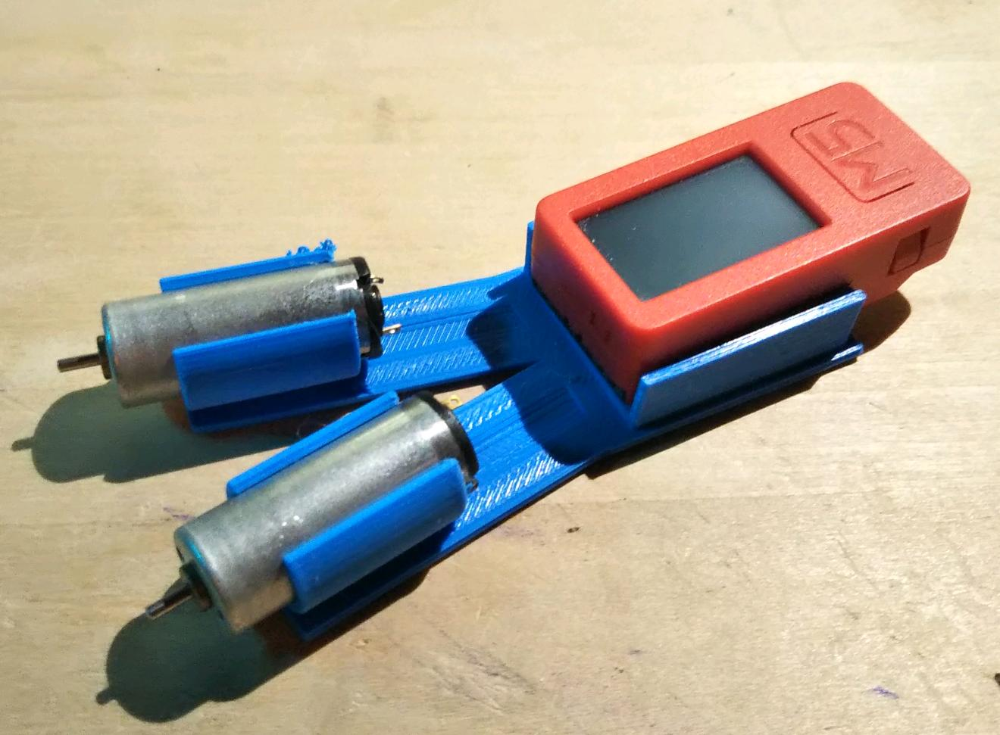

# touritsu_robo

倒立ロボット作成のメモです。

M5stackC plusと3Vモータを使います。

公開ファイルは、自由に使用してもらって問題ありません。
ただし、使用に関してはユーザーの判断でお願いします。

- Change log
    - 2021/10/14 driver holder,写真 update
    - 2021/10/2 touritsu_body update
    - 2021/10/1 first commit
